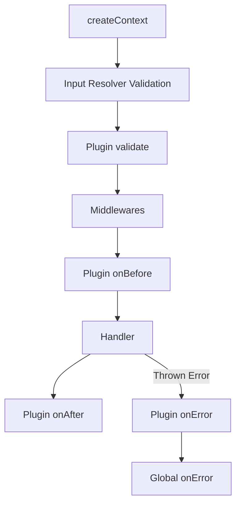

# Middleware & Plugins

Actyx RPC provides two ways to run side effects, modify contexts, or block execution: **Middlewares** and **Plugins**.

---

## Middlewares

Middlewares are functions that intercept execution. They can modify the context passed down the chain or abort execution early by returning an error object.

### Creating Middlewares
To declare a reusable middleware, use `procedure.middleware()`:

```ts
const requireSession = procedure.middleware(({ ctx, next }) => {
  if (!ctx.userId) {
    return { userId: "You must be signed in" };
  }
  return next();
});
```

### Extending Context
You can pass an object to `next()`. The fields are deeply merged into the context and fully typed for subsequent middlewares and handlers:

```ts
const withTenant = procedure.middleware(async ({ ctx, next }) => {
  const tenant = await getTenantForUser(ctx.userId);

  if (!tenant) {
    return { _message: "Tenant not found", _statusCode: 404 };
  }

  // Merges tenantId into ctx
  return next({
    tenantId: tenant.id,
  });
});
```

### Aborting early & Underscore Promotion
If a middleware returns a plain object (instead of calling `next()`), execution stops. Any keys starting with an underscore (`_`) prefix are promoted to the top-level error response:
* `_message` becomes `message`.
* `_reason` becomes `reason`.
* `_statusCode` becomes `statusCode`.

### Input Constraints
If a middleware requires a specific input shape to run, you can enforce it using the `ExpectedInput` generic:

```ts
const requirePostOwnership = procedure.middleware<{ postId: string }>(
  async ({ ctx, input, next }) => {
    // input.postId is strictly typed!
    const post = await db.post.find(input.postId);

    if (post.authorId !== ctx.userId) {
      return { _message: "Forbidden", _statusCode: 403 };
    }

    return next({ post });
  }
);
```

---

## Plugins

Plugins hook into the execution lifecycle and are ideal for features like audit logging, caching, and rate limiting.

### Creating Plugins
Use `procedure.plugin()` to declare a reusable plugin:

```ts
const withAudit = procedure.plugin<{ postId: string }>({
  validate(input) {
    // runs before middleware validation
    return { success: true, data: input };
  },
  onBefore({ ctx, input, next }) {
    console.log("Starting procedure...", input.postId);
    return next({ startTime: Date.now() });
  },
  onAfter(ctx, result) {
    const elapsed = Date.now() - ctx.startTime;
    console.log(`Finished in ${elapsed}ms`, result);
  },
  onError({ error, ctx }) {
    console.error(`Failed: ${error.message}`);
  },
});
```

---

## Applying Middlewares & Plugins

Once created, you apply middlewares and plugins to your procedures using the `.use()` method on the procedure builder.

Chaining multiple `.use()` calls executes them in the order they are attached:

```ts
const getProjects = procedure
  .use(requireSession)       // 1. Verifies session is present
  .use(withTenant)          // 2. Extends context with tenantId
  .use(withAudit)           // 3. Runs plugin hooks (validation, logging)
  .query(async ({ ctx }) => {
    // Both user.role and tenantId are fully typed in context here!
    return await db.project.findMany({
      where: { tenantId: ctx.tenantId },
    });
  });
```

---

## Execution Lifecycle Order

When a procedure executes, the lifecycle hooks run in this exact order:



---

## Builder Ordering

To ensure your configuration hooks (like `.cache()`, `.rateLimit()`, or `.retry()`) have access to fully enriched context types and validated input types, Actyx RPC strictly enforces the builder chain ordering:

1. **Setup Methods**: `.name()`, `.summary()`, `.description()`, `.meta()`, `.input()`, `.output()`
2. **Middlewares**: `.use(middleware)`
3. **Execution Policies**: `.authorize()`, `.mock()`, `.cache()`, `.retry()`, `.timeout()`, `.rateLimit()`, `.circuitBreaker()`, `.telemetry()`
4. **Terminal Handlers**: `.query()`, `.mutation()`, `.stream()`, `.sse()`

This order is strictly enforced at the TypeScript type level. Once you call an execution policy (e.g. `.cache()`), setup methods like `.use()` or `.input()` will no longer compile or appear in autocomplete.
