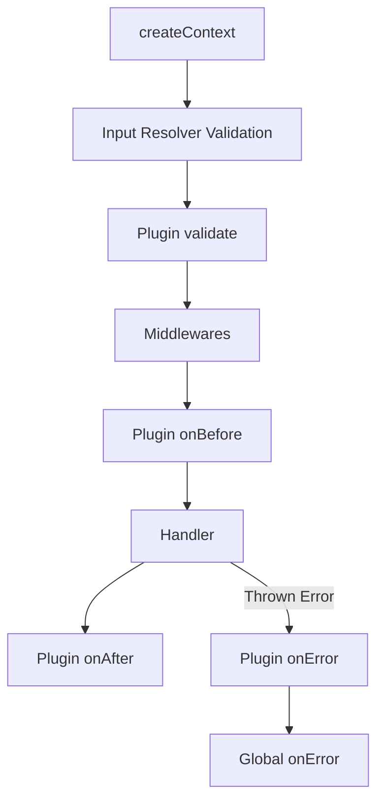

# Middleware & Plugins

Actyx RPC provides two ways to run side effects, modify contexts, or block execution: **Middlewares** and **Plugins**.

---

## Middlewares

Middlewares are functions that intercept execution. They can modify the context passed down the chain or abort execution early by returning an error object.

### Creating Middlewares

To declare a reusable middleware, use `procedure.middleware()`:

```ts
const requireSession = procedure.middleware(({ ctx, next }) => {
  if (!ctx.userId) {
    return { userId: "You must be signed in" };
  }
  return next();
});
```

### Extending Context

You can pass an object to `next()`. The fields are **shallow-merged** into the context and fully typed for subsequent middlewares and handlers:

```ts
const withTenant = procedure.middleware(async ({ ctx, next }) => {
  const tenant = await getTenantForUser(ctx.userId);

  if (!tenant) {
    return { _message: "Tenant not found", _statusCode: 404 };
  }

  // Merges tenantId into ctx
  return next({
    tenantId: tenant.id,
  });
});
```

:::warning Shallow Merge Only
Context merging uses `Object.assign`. If two middlewares set the same nested key, the later one **replaces** the entire value — it does not deep-merge.
:::

### Aborting early & Underscore Promotion

If a middleware returns a plain object (instead of calling `next()`), execution stops. Any keys starting with an underscore (`_`) prefix are promoted to the top-level error response:

- `_message` becomes `message`.
- `_reason` becomes `reason`.
- `_statusCode` becomes `statusCode`.

### Extra Arguments (Adapter Context)

Middlewares receive adapter-specific arguments as extra positional parameters after `{ ctx, input, next }`. For example, in the Next.js adapter, the second argument is the `Request` object and the third is the route `context`:

```ts
const logRequest = procedure.middleware(
  ({ ctx, next }, req: Request, context) => {
    console.log("URL:", req.url);
    return next({ url: req.url });
  },
);
```

### Input Constraints

If a middleware requires a specific input shape to run, you can enforce it using the `ExpectedInput` generic. Note the extra `()` call — it lets TypeScript infer the middleware's added context (`NextCtx`) from the `next()` call while you provide `ExpectedInput` explicitly:

```ts
const requirePostOwnership = procedure.middleware<{ postId: string }>()(
  async ({ ctx, input, next }) => {
    // input.postId is strictly typed!
    const post = await db.post.find(input.postId);

    if (post.authorId !== ctx.userId) {
      return { _message: "Forbidden", _statusCode: 403 };
    }

    return next({ post });
  },
);
```

---

## Plugins

Plugins hook into the execution lifecycle and are ideal for features like audit logging, caching, and rate limiting.

### Creating Plugins

Use `procedure.plugin()` to declare a reusable plugin:

```ts
const withAudit = procedure.plugin<{ postId: string }>()({
  validate(input) {
    // Runs before middlewares. Return enriched data to merge into input.
    return { success: true, data: { ...input, validatedAt: Date.now() } };
  },
  onBefore({ ctx, input, next }) {
    console.log("Starting procedure...", input.postId);
    return next({ startTime: Date.now() });
  },
  onAfter(ctx, result) {
    const elapsed = Date.now() - ctx.startTime;
    console.log(`Finished in ${elapsed}ms`, result);
  },
  onError({ error, ctx }) {
    console.error(`Failed: ${error.message}`);
  },
});
```

### Lifecycle Hooks

| Hook                                   | When it runs                               | Can modify behavior?                                             |
| -------------------------------------- | ------------------------------------------ | ---------------------------------------------------------------- |
| `validate(input)`                      | After input resolution, before middlewares | ✅ Can enrich input via `{ success: true, data }`                |
| `onBefore({ ctx, input, next })`       | After middlewares, before handler          | ✅ Can extend context like middleware                            |
| `onAfter(ctx, result)`                 | After successful handler return            | ❌ Fire-and-forget (errors logged to console)                    |
| `onError({ error, ctx, input, args })` | On error response or thrown exception      | ✅ Can return an `ErrorResponse` object to override the response |

### `validate` — Input Enrichment

The `validate` hook runs after input resolution and can enrich the input data by returning `{ success: true, data: { ... } }`. The returned `data` is spread-merged into the input before middlewares see it:

```ts
const withSlug = procedure.plugin({
  validate: (input: any) => {
    // Add computed fields to input
    return {
      success: true,
      data: { slug: input.title.toLowerCase().replace(/\s+/g, "-") },
    };
  },
});
```

### `onError` — Error Response Override

The `onError` hook can return an `ErrorResponse` object to replace the default error response. This is useful for translating errors, adding error codes, or suppressing internal details:

```ts
const withErrorMapping = procedure.plugin({
  onError({ error }) {
    if (error instanceof TimeoutError) {
      return {
        message: "Request timed out",
        reason: "TIMEOUT",
        statusCode: 504,
      };
    }
    // Returning void falls through to default error handling
  },
});
```

If `onError` returns `void` (or `undefined`), execution continues to the next plugin and then to the procedure-level `onError` callback.

---

## Built-in: `observabilityPlugin`

Actyx RPC ships with an `observabilityPlugin` that tracks execution metrics:

```ts
import { observabilityPlugin } from "@explita/actyx-rpc";

const proc = procedure
  .use(observabilityPlugin({
    onCall: ({ name, duration, success, error }) => {
      metrics.record(name, { duration, success, error });
    },
  }))
  .query(async ({ ctx }) => { ... });
```

It automatically measures duration and reports success/failure via the `onCall` callback.

---

## Applying Middlewares & Plugins

Once created, you apply middlewares and plugins to your procedures using the `.use()` method on the procedure builder.

Chaining multiple `.use()` calls executes them in the order they are attached:

```ts
const getProjects = procedure
  .use(requireSession) // 1. Verifies session is present
  .use(withTenant) // 2. Extends context with tenantId
  .use(withAudit) // 3. Runs plugin hooks (validation, logging)
  .query(async ({ ctx }) => {
    // Both user.role and tenantId are fully typed in context here!
    return await db.project.findMany({
      where: { tenantId: ctx.tenantId },
    });
  });
```

### Type Safety After `.use()`

After calling `.input()` and `.use()`, TypeScript enforces that you cannot re-add setup methods:

```ts
procedure
  .input(zodResolver(schema))
  .use(myMiddleware)
  .input(anotherSchema) // ❌ TypeScript error — input is no longer available
  .use(anotherMiddleware) // ❌ TypeScript error — middleware must come before .input()
  .query(handler);
```

This ensures middlewares always have access to validated input types.

---

## Testing Middlewares & Plugins

```ts
import { describe, it, expect } from "vitest";
import { createProcedure } from "@explita/actyx-rpc";

const procedure = createProcedure({
  inputMode: "form",
  createContext: () => ({ ok: true, ctx: {} }),
});

it("should block unauthenticated requests", async () => {
  const authMw = procedure.middleware(({ ctx, next }) => {
    if (!ctx.userId) {
      return { _message: "Unauthorized", _statusCode: 401 };
    }
    return next();
  });

  const proc = procedure.use(authMw).query(async ({ ctx }) => {
    return { userId: ctx.userId };
  });

  const [data, error] = await proc();
  expect(data).toBeNull();
  expect(error?.message).toBe("Unauthorized");
  expect(error?.statusCode).toBe(401);
});

it("plugin.onError can override error responses", async () => {
  const errorPlugin = {
    onError: async () => ({
      message: "Custom error",
      statusCode: 418,
    }),
  };

  const proc = procedure.use(errorPlugin).query(async () => {
    throw new Error("boom");
  });

  const [data, error] = await proc();
  expect(error?.message).toBe("Custom error");
  expect(error?.statusCode).toBe(418);
});
```

---

## Execution Lifecycle Order

When a procedure executes, the lifecycle hooks run in this exact order:



---

## Builder Ordering

To ensure your configuration hooks (like `.cache()`, `.rateLimit()`, or `.retry()`) have access to fully enriched context types and validated input types, Actyx RPC strictly enforces the builder chain ordering:

1. **Setup Methods**: `.name()`, `.summary()`, `.description()`, `.meta()`, `.input()`, `.output()`
2. **Middlewares**: `.use(middleware)`
3. **Execution Policies**: `.authorize()`, `.mock()`, `.cache()`, `.retry()`, `.timeout()`, `.rateLimit()`, `.circuitBreaker()`, `.telemetry()`
4. **Terminal Handlers**: `.query()`, `.mutation()`, `.stream()`, `.sse()`

This order is strictly enforced at the TypeScript type level. Once you call an execution policy (e.g. `.cache()`), setup methods like `.use()` or `.input()` will no longer compile or appear in autocomplete.
