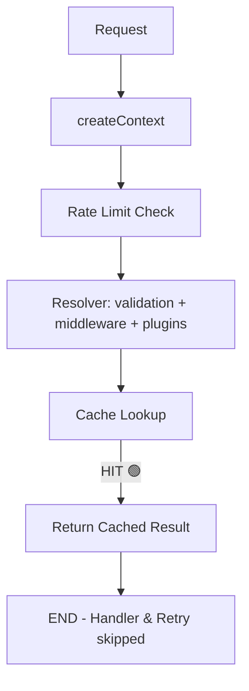
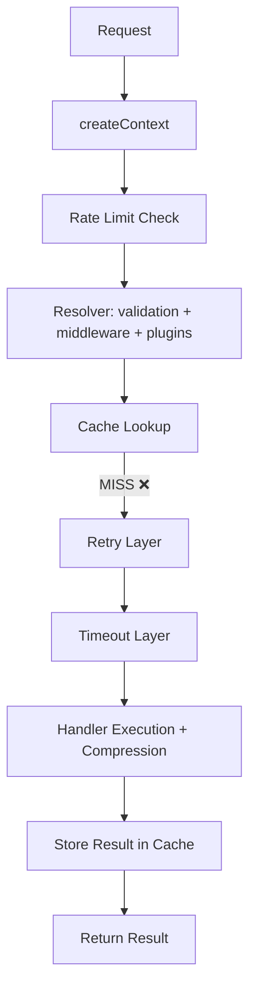
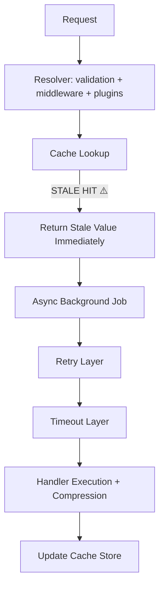

# Caching & Invalidation

Actyx RPC includes powerful caching policies supporting request deduplication, stale-while-revalidate, Redis storage, and automatic key invalidation on mutation.

---

## `.cache()`

Add caching to your queries to cache successful results and avoid repeated database or network calls.

```ts
import { MemoryCache } from "@explita/actyx-rpc";

const procedure = createProcedure({
  cache: new MemoryCache({ maxSize: 1000, defaultTTL: 60000 }),
});

const getUser = procedure
  .cache({
    ttl: 60000,                 // Cache for 60 seconds
    staleTime: 30000,           // Data becomes stale after 30 seconds
    staleWhileRevalidate: true, // Return stale data while revalidating in the background
    key: (input) => `user:${input.id}`,
  })
  .input(z.object({ id: z.string() }))
  .query(async ({ input }) => {
    return await db.users.findById(input.id);
  });
```

### Cache Configuration Options

| Option | Type | Default | Description |
| :--- | :--- | :--- | :--- |
| `ttl` | `number` | `60000` | Cache time-to-live in milliseconds. |
| `staleTime` | `number` | `0` | Delay in ms before data is considered stale. `0` means always stale. |
| `staleWhileRevalidate` | `boolean` | `false` | Return stale cache immediately and fetch fresh data in the background. |
| `key` | `(input) => string` | `JSON.stringify` | Custom key generator function. |
| `onHit` | `(key, data) => void` | — | Callback run on cache hit. |
| `onMiss` | `(key) => void` | — | Callback run on cache miss. |
| `decompress` | `boolean` | `false` | Set to true if response payload compression was configured. |

---

## Cache Adapters

### Redis Cache Adapter
For distributed systems, configure a Redis adapter inside `createProcedure`:

```ts
import Redis from "ioredis";
import { RedisCache, createProcedure } from "@explita/actyx-rpc";

const redis = new Redis({ host: "localhost", port: 6379 });
const redisCache = new RedisCache(redis, {
  prefix: "myapp:cache:",
  defaultTTL: 300, // seconds
});

const procedure = createProcedure({
  cache: redisCache,
});
```

### Custom Cache Adapter
To implement a custom cache (e.g., memcached, cloudflare KV), implement the `CacheAdapter` interface:

```ts
interface CacheAdapter {
  get<T>(key: string): Promise<T | undefined> | T | undefined;
  set<T>(
    key: string,
    data: T,
    options?: { ttl?: number; staleTime?: number },
  ): Promise<void> | void;
  isStale(key: string): Promise<boolean> | boolean;
  delete(key: string): Promise<boolean> | boolean;
  clear(): Promise<void> | void;
}
```

---

## `.invalidate()`

Trigger cache invalidation automatically after a mutation completes successfully.

```ts
const updatePost = procedure
  .input(z.object({ id: z.string(), title: z.string() }))
  .invalidate({
    keys: ({ input }) => [`post:${input.id}`, "posts:list"],
    tags: ["posts"],
  })
  .mutation(async ({ input }) => {
    // ... update database
    return { success: true };
  });
```

### Invalidation Options

| Option | Type | Description |
| :--- | :--- | :--- |
| `keys` | `string \| string[] \| (opts) => string[]` | Specific cache key(s) to delete. |
| `patterns` | `string \| string[] \| (opts) => string[]` | Glob patterns to match keys (if supported by cache adapter). |
| `tags` | `string \| string[] \| (opts) => string[]` | Specific cache tag(s) to invalidate. |
| `delay` | `number` | Delay in ms before invalidation runs. |

---

## Combining Cache & Retry

When `.cache()` and `.retry()` are used together, the cache wraps the retry layer. This means if a valid cached result exists, execution stops immediately and the retry logic is never reached. Only on a cache miss (or stale entry requiring recomputation) does the flow continue into retry and then the handler.

```ts
const getUser = procedure
  .retry({ attempts: 3 }) // Retry on failure
  .cache({ ttl: 60000 })  // Cache successful results
  .query(async ({ input }) => {
    return await db.users.findById(input.id);
  });
```

> [!NOTE]
> Input validation and middleware always run **before** the cache check. This ensures auth and rate limiting apply to all requests, including cached ones. The validation overhead is minimal.

---

## Execution Flow

The following flows illustrate the execution path and ordering of context, rate-limiting, resolvers, caching, and handler execution.

### 1. Normal Request (Cache Hit)

If a valid cached result exists, execution returns early. Retries, timeouts, and handlers are never reached.



### 2. Normal Request (Cache Miss)

On a cache miss, the execution chain proceeds through retries and timeouts down to the actual handler.



### 3. Stale Cache (Revalidation Case)

If `staleWhileRevalidate` is set to `true`, a stale value is returned to the user immediately, and recomputation triggers asynchronously in the background.



